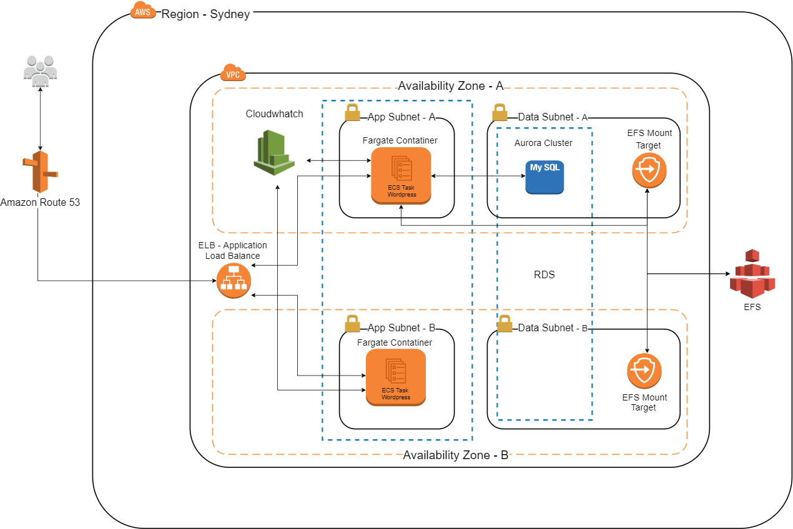

# DevOps - Project 01 - Group 01 - Wordpress Solution 

Solution based on AWS to install wordpress site with Fargate and Aurora DB Cluster. 

## Solution Diagram 



## Requirements 

- Make
- Docker-compose 
- Git
- Bash

## Usage

Clone or download the repository:

```
git clone https://github.com/devopsacademyau/2020-feb-project1-group1.git
```

Set up variables on .env file:

```
AWS_ACCESS_KEY_ID="<id>"
AWS_SECRET_ACCESS_KEY="<key>"
AWS_DEFAULT_REGION="<region>"
TF_VAR_project_name="<string>"
TF_VAR_db_username="<string>"
TF_VAR_db_password="<string>"
```

Plan:

Create an execution plan:
```
make plan
```

Build:

Create an ECR repository, build wordpress docker image and push to the repository created:
```
make build
```

Deploy:

Deploy the infrastructure on AWS using the docker image pushed to ECR
```
make build
```

Destroy:

Destory all the infrastructure created on AWS
```
make destroy
```
